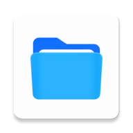
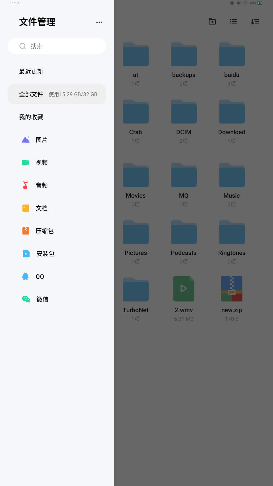
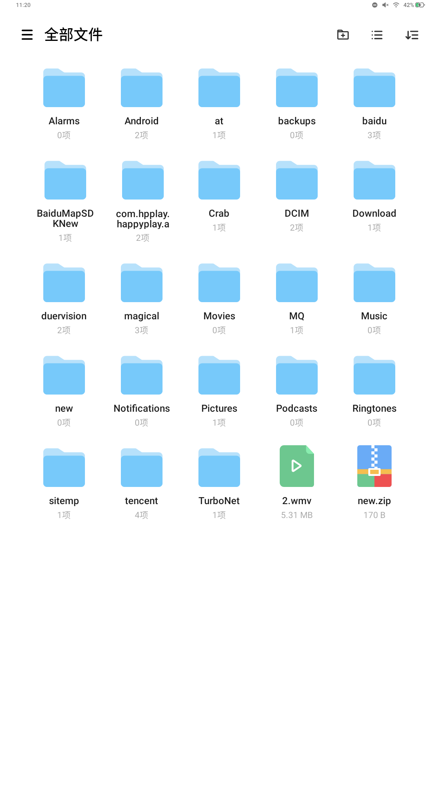
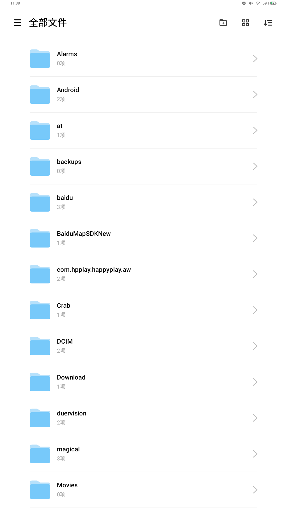
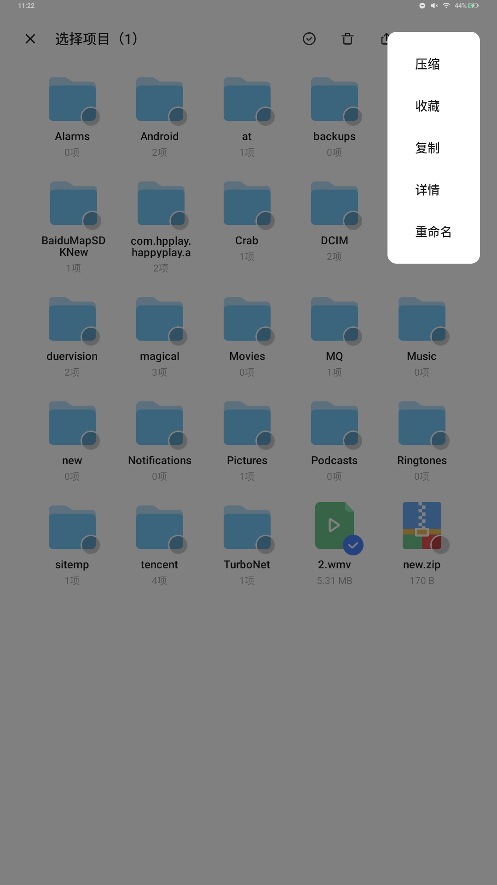
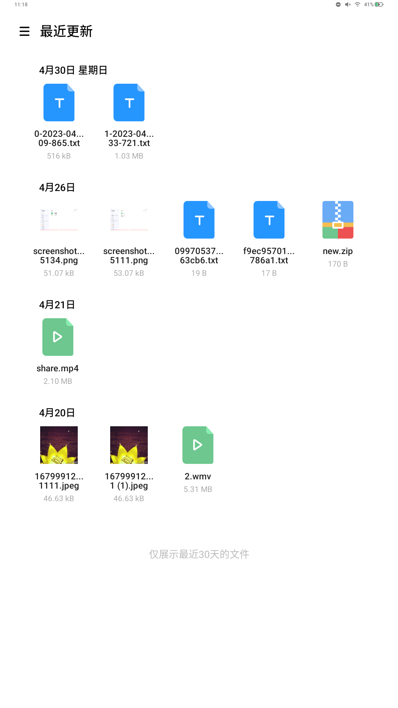

# FileManager
  

一款适用于平板的三方文件管理器

## 预览

                            

## 功能

* 可查看最近30天内发生修改的文件；
* 支持sdcard目录下未隐藏文件的基本文件操作：复制、移动、删除、重命名；
* 文件分享：分享文件至QQ、微信等，兼容至Android 13 URI分享；
* 文件压缩：zip、7z、tar.xz；
* 文件、文件夹名关键词搜索；
* 支持文件夹、文件本地收藏；
* 支持垂直列表和网格布局切换

## 后续新增和优化的功能

* 支持USB设备文件传输
* UI上可以适配较多不同分辨率的设备
* 提升压缩、解压文件速度
* 外部软件使用该文件管理器打开压缩包
* 多个文件分享时uri data大小限制

## 特别感谢

[MaterialFiles](https://github.com/zhanghai/MaterialFiles)

[SimpleMobileTools](https://github.com/SimpleMobileTools/Simple-File-Manager)

## 许可证

    Copyright (C) 2023 HpBoss
    
    This program is free software: you can redistribute it and/or modify
    it under the terms of the GNU General Public License as published by
    the Free Software Foundation, either version 3 of the License, or
    (at your option) any later version.
    
    This program is distributed in the hope that it will be useful,
    but WITHOUT ANY WARRANTY; without even the implied warranty of
    MERCHANTABILITY or FITNESS FOR A PARTICULAR PURPOSE.  See the
    GNU General Public License for more details.
    
    You should have received a copy of the GNU General Public License
    along with this program.  If not, see <https://www.gnu.org/licenses/>.
